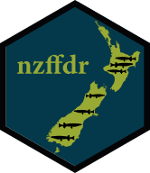

# nzffdr </a>

<!-- badges: start -->

[](https://github.com/flee598/nzffdr/actions)
<!-- badges: end -->

The purpose of this package is allow for direct access to the NZ
Freshwater Fish Database ([NZFFD](https://nzffdms.niwa.co.nz/search))
from R and additional functions for cleaning imported data and adding
missing data.

For a detailed guide to using the package see the [help
page](https://flee598.github.io/nzffdr/).

### Installation

``` r
# devtools::install_github("flee598/nzffdr")
library(nzffdr)
```

### Import data from the NZFFD

This function requires an internet connection to query the NZFFD
database.

``` r
# import all records between 2000 and 2010
dat <- nzffd_import(catchment = "", river = "", location = "", 
  fish_method = "", species = "", starts = 2000, ends = 2010)
head(dat)
#>   card m    y catchname   catch                locality time org map    east
#> 1  294 5 2000    Long B 075.000 Unnamed stream Long Bay      arc r10 2664600
#> 2  294 5 2000    Long B 075.000 Unnamed stream Long Bay      arc r10 2664600
#> 3  294 5 2000    Long B 075.000 Unnamed stream Long Bay      arc r10 2664600
#> 4  295 5 2000    Long B 075.000 Unnamed stream Long Bay      arc r10 2664600
#> 5  295 5 2000    Long B 075.000 Unnamed stream Long Bay      arc r10 2664600
#> 6  295 5 2000    Long B 075.000 Unnamed stream Long Bay      arc r10 2664600
#>     north altitude penet fishmeth effort pass spcode abund number minl maxl
#> 1 6499800       30     3      gmt      6   NA galfas            2   95  110
#> 2 6499800       30     3      gmt      6   NA gobhut            2   80   85
#> 3 6499800       30     3      gmt      6   NA parane            1   40   NA
#> 4 6499800       30     3      fyn      3   NA parane            2   70   75
#> 5 6499800       30     3      fyn      3   NA gobgob            1  150   NA
#> 6 6499800       30     3      fyn      3   NA galfas            3  130  135
#>   nzreach
#> 1 2004154
#> 2 2004154
#> 3 2004154
#> 4 2004154
#> 5 2004154
#> 6 2004154

# To import the entire NZFF database:
# dat <- nzffd_import()
```

### Cleaning data

``` r
dat2 <- nzffd_clean(dat)
head(dat2)
#>   card m    y catchname   catch                locality time org map    east
#> 1  294 5 2000    Long B 075.000 Unnamed Stream Long Bay   NA arc r10 2664600
#> 2  294 5 2000    Long B 075.000 Unnamed Stream Long Bay   NA arc r10 2664600
#> 3  294 5 2000    Long B 075.000 Unnamed Stream Long Bay   NA arc r10 2664600
#> 4  295 5 2000    Long B 075.000 Unnamed Stream Long Bay   NA arc r10 2664600
#> 5  295 5 2000    Long B 075.000 Unnamed Stream Long Bay   NA arc r10 2664600
#> 6  295 5 2000    Long B 075.000 Unnamed Stream Long Bay   NA arc r10 2664600
#>     north altitude penet fishmeth effort pass spcode abund number minl maxl
#> 1 6499800       30     3      gmt      6   NA galfas  <NA>      2   95  110
#> 2 6499800       30     3      gmt      6   NA gobhut  <NA>      2   80   85
#> 3 6499800       30     3      gmt      6   NA parane  <NA>      1   40   NA
#> 4 6499800       30     3      fyn      3   NA parane  <NA>      2   70   75
#> 5 6499800       30     3      fyn      3   NA gobgob  <NA>      1  150   NA
#> 6 6499800       30     3      fyn      3   NA galfas  <NA>      3  130  135
#>   nzreach   form
#> 1 2004154 Stream
#> 2 2004154 Stream
#> 3 2004154 Stream
#> 4 2004154 Stream
#> 5 2004154 Stream
#> 6 2004154 Stream
```

### Filling gaps

``` r
dat3 <- nzffd_fill(dat2, alt = TRUE, maps = TRUE)
head(dat3)
#>   spcode   card  m    y    catchname   catch                locality     time
#> 1 aldfor  29348  5 2007       Whau R 080.060         Avondale Stream 11:00:00
#> 2 aldfor  21454  2 2002       Long B 075.000 Unnamed Stream Long Bay     <NA>
#> 3 aldfor  23928  1 2004      Clive R 231.520          Raupare Stream 21:05:00
#> 4 aldfor 105608 11 2003   Manawatu R 325.000          Manawatu River     <NA>
#> 5 aldfor 108028  5 2005  Waituna Lgn 776.000          Waituna Lagoon     <NA>
#> 6 aldfor  23213  3 2003 Porangahau R 243.000        Porangahau River     <NA>
#>    org map    east   north altitude penet fishmeth effort pass abund number
#> 1  bma r11 2661200 6475000       10     2      nte     50    1  <NA>      4
#> 2 nscc r10 2665859 6500387       10     1      han     NA   NA  <NA>      6
#> 3 hbrc v21 2842200 6170800        4     8      spo    200   NA  <NA>      6
#> 4  uow s24 2702114 6074811       14     8      efb    200   NA  <NA>      3
#> 5  sit f47 2170262 5396529       38    NA      fyn     13   NA  <NA>     11
#> 6 doch v24 2816600 6093900        5     8      ntc      7   NA  <NA>     16
#>   minl maxl  nzreach   form      common_name             sci_name    family
#> 1  230  260  2006167 Stream Yelloweye mullet Aldrichetta forsteri Mugilidae
#> 2   NA  150  2004122 Stream Yelloweye mullet Aldrichetta forsteri Mugilidae
#> 3   NA   NA  8025062 Stream Yelloweye mullet Aldrichetta forsteri Mugilidae
#> 4   NA   NA  7043284  River Yelloweye mullet Aldrichetta forsteri Mugilidae
#> 5   NA   NA 15319597 Lagoon Yelloweye mullet Aldrichetta forsteri Mugilidae
#> 6  154  290  8034472  River Yelloweye mullet Aldrichetta forsteri Mugilidae
#>         genus  species   threat_class native
#> 1 Aldrichetta forsteri not threatened native
#> 2 Aldrichetta forsteri not threatened native
#> 3 Aldrichetta forsteri not threatened native
#> 4 Aldrichetta forsteri not threatened native
#> 5 Aldrichetta forsteri not threatened native
#> 6 Aldrichetta forsteri not threatened native
```

### Adding River Environment Classification data

This function requires an internet connection to query the REC database.

``` r
dat4 <- nzffd_add(dat3)
head(dat4)
#>   nzreach spcode  card  m    y     catchname   catch                 locality
#> 1       0 parcur 23724  8 2007      Rakaia R 685.050          Unnamed Wetland
#> 2       0 gobhut 20798  3 2005     Waitara R 395.040 Manganui River Fish Pass
#> 3       0 parcur 28870 12 2005     Waitaki R 711.396            Glenmore Tarn
#> 4       0 galmac 27313  1 2008     Moutere R 571.000          Unnamed Wetland
#> 5       0 nospec 16070  1 2003 Waimakariri R 664.045             Unnamed Pond
#> 6       0 gamaff 23074  7 2007      Auckland 081.010   Oakley Creek Tributary
#>       time  org map    east   north altitude penet fishmeth effort pass abund
#> 1 10:34:00 docc k35 2403381 5763836      820   110      gmt      4   NA     n
#> 2 16:20:00 bior q19 2620200 6220100      215    43      efp     NA    1  <NA>
#> 3     <NA> docc i37 2303285 5699237      890   201      gmt      8   NA     n
#> 4 22:00:00  tka n27 2511483 6009553        5     2      spo   1000   NA     c
#> 5     <NA> docc m35 2478600 5758700       10    10      ntc      5   NA  <NA>
#> 6 12:00:00  bma r11 2663700 6476400       45     5      nfc    100    1  <NA>
#>   number minl maxl      form         common_name             sci_name
#> 1     NA   NA   NA   Wetland   Freshwater shrimp Paratya curvirostris
#> 2      4   40   45     River        Redfin bully Gobiomorphus huttoni
#> 3     NA   NA   NA      Tarn   Freshwater shrimp Paratya curvirostris
#> 4     NA   65   90   Wetland              Inanga   Galaxias maculatus
#> 5     NA   NA   NA      Pond No species recorded                  Nil
#> 6      7   15   30 Tributary            Gambusia     Gambusia affinis
#>        family        genus      species   threat_class     native OBJECTID
#> 1     Atyidae      Paratya curvirostris not threatened     native       NA
#> 2  Eleotridae Gobiomorphus      huttoni not threatened     native       NA
#> 3     Atyidae      Paratya curvirostris not threatened     native       NA
#> 4  Galaxiidae     Galaxias    maculatus        at risk     native       NA
#> 5          NA         <NA>         <NA>           <NA>       <NA>       NA
#> 6 Poeciliidae     Gambusia      affinis     introduced introduced       NA
#>   FNODE TNODE LENGTH REACH_ID FNODE_1 TNODE_1 ORDER CLIMATE SRC_OF_FLW GEOLOGY
#> 1    NA    NA     NA       NA      NA      NA    NA    <NA>       <NA>    <NA>
#> 2    NA    NA     NA       NA      NA      NA    NA    <NA>       <NA>    <NA>
#> 3    NA    NA     NA       NA      NA      NA    NA    <NA>       <NA>    <NA>
#> 4    NA    NA     NA       NA      NA      NA    NA    <NA>       <NA>    <NA>
#> 5    NA    NA     NA       NA      NA      NA    NA    <NA>       <NA>    <NA>
#> 6    NA    NA     NA       NA      NA      NA    NA    <NA>       <NA>    <NA>
#>   LANDCOVER NET_POSN VLY_LNDFRM CSOF CSOFG CSOFGL CSOFGLNP CSOFGLNPVL SPRING
#> 1      <NA>     <NA>       <NA> <NA>  <NA>   <NA>     <NA>       <NA>   <NA>
#> 2      <NA>     <NA>       <NA> <NA>  <NA>   <NA>     <NA>       <NA>   <NA>
#> 3      <NA>     <NA>       <NA> <NA>  <NA>   <NA>     <NA>       <NA>   <NA>
#> 4      <NA>     <NA>       <NA> <NA>  <NA>   <NA>     <NA>       <NA>   <NA>
#> 5      <NA>     <NA>       <NA> <NA>  <NA>   <NA>     <NA>       <NA>   <NA>
#> 6      <NA>     <NA>       <NA> <NA>  <NA>   <NA>     <NA>       <NA>   <NA>
#>   NZFNODE NZTNODE DISTSEA CATCHAREA
#> 1      NA      NA      NA        NA
#> 2      NA      NA      NA        NA
#> 3      NA      NA      NA        NA
#> 4      NA      NA      NA        NA
#> 5      NA      NA      NA        NA
#> 6      NA      NA      NA        NA
```

You should now have a cleaned up dataframe of NZFFD records available to
you, optionally along with some missing data and associated REC data.
