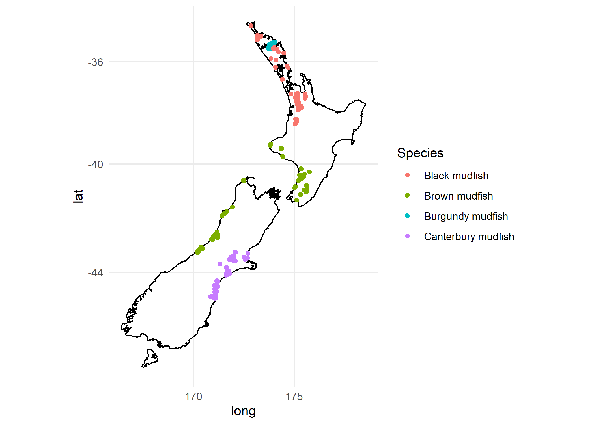
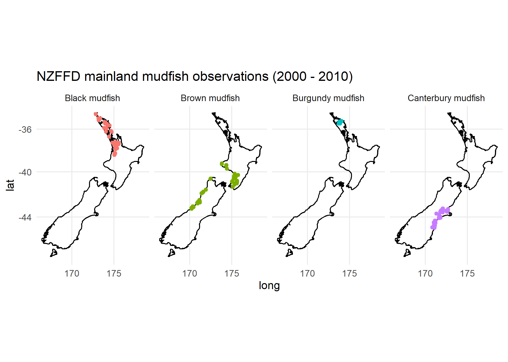
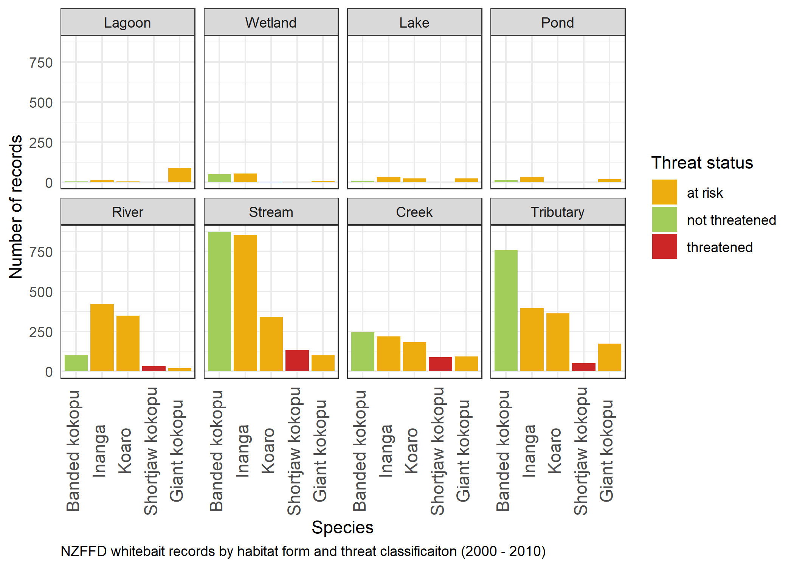

<!-- README.md is generated from README.Rmd. Please edit that file -->

# nzffdr </a>

<!-- badges: start -->

<!-- badges: end -->

The purpose of this package is allow for direct access to the NZ
Freshwater Fish Database from R and additional functions for cleaning
imported data and adding missing data. The
[NZFFD](https://nzffdms.niwa.co.nz/search) has over 140,000 records of
freshwater fish observations from around New Zealand. The database
incudes: site locations, fishing methods, site coordinates, species
information and limited phyiochemical data.

We welcome any feedback, issues or questions that users may encounter
through our issues tracker on GitHub: *Add URL*.

### Installation

``` r
# devtools::install_github("flee598/nzffdr")
library(nzffdr)
```

### Built-in datasets

There are three built-in datasets to assist, these are:

  - `nzffd_data` a subset of 200 rows from the NZFFD, used for examples,
    tutorials etc.

  - `method_nzffd` a dataframe containing all the different fishing
    methods included in the NZFFD, it is possible to search the database
    using these terms so they are provided for reference.

  - `species_nzffd` a dataframe of the scientific and common names of
    all species. It is possible to search the database by species name
    (using scientific or common names) so these are provided for
    reference.

### Getting data

We start by importing some data. We have tried to make the search terms
match those you would use directly on the Niwa site. For example leaving
a search field blank will return all records. There are seven search
arguments:

  - `catchment` this refers to the Catchment No. a 6 digit number unique
    to the reach of interest. You can search using the inidviual number
    (e.g. `catchment = "702.500"`), or for all rivers in a catchment you
    can use the wildcard search term (e.g. `catchment = "702%"`), or
    don’t set the arg if you want all catchments in NZ.

  - `river` search for a river by name, to get all records for the
    Clutha (e.g. `river = "Clutha"`).

  - `location` search for river by location e.g. (`location =
    "Nelson"`).

  - `fish_method` search by fishing method used. There are 59 different
    possible options for `fish_method`, if you want to search for a
    specific fishing method use `method_nzffd()` to see a list of all
    possible options, you can then copy/paste from there (e.g. if we
    only wanted fish caught be lures use `fish_meth = "Angling - Lure"`)
    don’t set the arg if you want all fishing methods.

  - `species` search for a particular species. There are 75 different
    possible options for `species`, use `species_nzffd()` to see a list
    of all possible options. You can search using either common or
    scientific names and can search for multiple species at once.
    e.g. to search for Black mudfish use `species = "Black mudfish"` or
    `species = "Neochanna diversus"` and to search for Black mudfish and
    Bluegill bully use `species = c("Black mudfish", "Bluegill bully")`
    etc.

  - `starts` starting search date, 1850 at the earliest.

  - `ends` ending search date.

This function requires an internet connection to query Niwa’s database.

Data citation: Crow S (2017). New Zealand Freshwater Fish Database.
Version 1.2. The National Institute of Water and Atmospheric Research
(NIWA). Occurrence Dataset <https://doi.org/10.15468/ms5iqu>

``` r
# import all records between 2000 and 2010
dat <- import_nzffd(catchment = "", river = "", location = "", 
  fish_method = "", species = "", starts = 2000, ends = 2010)

head(dat)
#>   card m    y catchname   catch                locality time org map    east
#> 1  294 5 2000    Long B 075.000 Unnamed stream Long Bay      arc r10 2664600
#> 2  294 5 2000    Long B 075.000 Unnamed stream Long Bay      arc r10 2664600
#> 3  294 5 2000    Long B 075.000 Unnamed stream Long Bay      arc r10 2664600
#> 4  295 5 2000    Long B 075.000 Unnamed stream Long Bay      arc r10 2664600
#> 5  295 5 2000    Long B 075.000 Unnamed stream Long Bay      arc r10 2664600
#> 6  295 5 2000    Long B 075.000 Unnamed stream Long Bay      arc r10 2664600
#>     north altitude penet fishmeth effort pass spcode abund number minl maxl
#> 1 6499800       30     3      gmt      6   NA parane            1   40   NA
#> 2 6499800       30     3      gmt      6   NA gobhut            2   80   85
#> 3 6499800       30     3      gmt      6   NA galfas            2   95  110
#> 4 6499800       30     3      fyn      3   NA parane            2   70   75
#> 5 6499800       30     3      fyn      3   NA gobgob            1  150   NA
#> 6 6499800       30     3      fyn      3   NA galfas            3  130  135
#>   nzreach
#> 1 2004154
#> 2 2004154
#> 3 2004154
#> 4 2004154
#> 5 2004154
#> 6 2004154
```

### Cleaning data

While the data imported from NZFFD is in pretty good shape there are
some small inconsistencies. The `clean_nzffd()` function aims to deal
with some of these inconsistencies. In particular text strings have been
standardised. The first letter of all words in `catchname` and
`locality` are capitalised and any non-alphanumeric characters are
removed. `time` is converted to a standardised 24 hour format and
nonsesical values converted to `NA`. `org` is converted to all lowercase
and has non-alphanumeric characters removed. `map` is converted to lower
case and has any non-three digit codes converted to `NA`. `catchname`
codes are tidied following the suggested abbreviations (*URL*),
e.g. “Cluth River”, “Clutha r” and “Clutha river” all become Clutha
R. Finally a new variable `form` is added which defines each observation
as from one of the following systems: `Creek, River, Tributary, Stream,
Lake, Lagoon, Pond, Burn, Race, Dam, Estuary, Swamp, Drain, Canal, Tarn,
Wetland, Reservoir, Brook, Spring, Gully` or `NA`.

``` r
dat2 <- clean_nzffd(dat)
head(dat2)
#>   card m    y catchname   catch                locality time org map    east
#> 1  294 5 2000    Long B 075.000 Unnamed Stream Long Bay   NA arc r10 2664600
#> 2  294 5 2000    Long B 075.000 Unnamed Stream Long Bay   NA arc r10 2664600
#> 3  294 5 2000    Long B 075.000 Unnamed Stream Long Bay   NA arc r10 2664600
#> 4  295 5 2000    Long B 075.000 Unnamed Stream Long Bay   NA arc r10 2664600
#> 5  295 5 2000    Long B 075.000 Unnamed Stream Long Bay   NA arc r10 2664600
#> 6  295 5 2000    Long B 075.000 Unnamed Stream Long Bay   NA arc r10 2664600
#>     north altitude penet fishmeth effort pass spcode abund number minl maxl
#> 1 6499800       30     3      gmt      6   NA parane            1   40   NA
#> 2 6499800       30     3      gmt      6   NA gobhut            2   80   85
#> 3 6499800       30     3      gmt      6   NA galfas            2   95  110
#> 4 6499800       30     3      fyn      3   NA parane            2   70   75
#> 5 6499800       30     3      fyn      3   NA gobgob            1  150   NA
#> 6 6499800       30     3      fyn      3   NA galfas            3  130  135
#>   nzreach   form
#> 1 2004154 Stream
#> 2 2004154 Stream
#> 3 2004154 Stream
#> 4 2004154 Stream
#> 5 2004154 Stream
#> 6 2004154 Stream

# quick check for changes in the number of different catchment names (a 
# reduction means, names have successfully been recoded)
length(unique(dat$catchname))
#> [1] 881
length(unique(dat2$catchname))
#> [1] 788
```

The above changes, while superfical make analysis that, for example
relies on grouping by river name much cleaner.

### Filling gaps.

Both the `map` and `altitude` variables have some `NA` values, here we
can fill most of them with `fill_nzffd()`. To fill `map` and `altitude`
we run the observation coordinates (NZMG) against a raster projection of
the NZMS260 MapTiles (URL) and an 8m digital elevation model of NZ
(URL). Note the ‘altitude’ values are not exact (margin of error??) so
we suggest they are used in an exploratory manner only.

NZ Map Tiles sauce: NZ 8m DEM sauce:

``` r
# number of NA's in input variables map and altitude
sum(is.na(dat2$map))
#> [1] 851
sum(is.na(dat2$altitude))
#> [1] 580

dat3 <- fill_nzffd(dat2, alt = TRUE, maps = TRUE)

# number of NA's in output data
sum(is.na(dat3$maps))
#> [1] 0
sum(is.na(dat3$altitude))
#> [1] 0
```

We also have a function for queurying the 8m DEM if you just want to
supply a dataframe of Easting and Northing coordinates (see below). *ADD
THIS*

### Adding REC data

We can also add data from the River Environment/Ecosystem(??)
Classification 2(??) database using `add_nzffd()`. This function takes
the `nzreach` variable and matches it again the cooresponding `NZREACH`
variable in the REC database and imports all the REC data. Note this
will add 24 new columns to your dataframe, with the original REC column
names, we suggest renaming the REC columns as they are a bit fiendish as
is.

This function requires an internet connection to query the REC database.
REC sauce: *add citation*

``` r
dim(dat3)
#> [1] 58539    27

dat4 <- add_nzffd(dat3)

dim(dat4)
#> [1] 58539    51
```

You should now have a cleaned up dataframe of NZFFD records available to
you, optionally along with some missing data along with associated REC
data. That is it for the main nzffdr functions, there is one more which
allows you to submit a two-column dataframe of coordinates (in NZMG) and
get back the associated elevation data from the 8m NZ DEM -
`dem_nzffd()`. *add this*

``` r
# sites <- xxx
# sites_dem <- dem_nzffd(sites)
# head(sites_dem)
```

### Do something with the data

The follow is a quick example of what you can do with the cleaned nzffd
data, this section requires the additional packages: `devtools,
tidyverse, sp, southernMaps`.

Make a map of Mudfish distributions:

``` r

# load required packages
library(devtools)
# devtools::install_github("orb16/southernMaps")
library(southernMaps) # NZ map that plays nice
library(tidyverse)    # data handling functions
library(sp)           # coordinate conversion
library(rgdal)        # coordinate conversion
library(nzffdr)

# Add WGS84 lat longs ---------------------------------------------------------

# transform the NZFFD coords (from NZMG to WGS84 lat/long)

dat_coord <- data.frame(x = dat4$east, y = dat4$north)
sp::coordinates(dat_coord) <- ~ x + y

proj4string <- "+proj=nzmg +lat_0=-41 +lon_0=173 +x_0=2510000 +y_0=6023150 
+ellps=intl +datum=nzgd49 +units=m +towgs84=59.47,-5.04,187.44,0.47,-0.1,1.024,-4.5993 
+nadgrids=nzgd2kgrid0005.gsb +no_defs" # NZMG49

sp::proj4string(dat_coord) <- sp::CRS(proj4string) 

dat_coord <- sp::spTransform(dat_coord, sp::CRS("+init=epsg:4326")) #WGS84
dat_coord <- as.data.frame(dat_coord)

# reattch coords
dat4$wgs84_x <- dat_coord$x
dat4$wgs84_y <- dat_coord$y

# Subset Mudfish data ---------------------------------------------------------

mud <- c("Canterbury mudfish", "Burgundy mudfish", 
         "Brown mudfish", "Black mudfish")

fish_map <- dat4 %>%
  filter(common_name %in% mud) %>%
  filter(catch != "Chatham")

# Mapping ---------------------------------------------------------------------

# get a friendly NZ map
nzmap <- southernMaps::nzHigh
nzmap <- southernMaps::fortify_polygons(nzmap, proj = "wgs84")

# Plot all 4 species on one map
ggplot(nzmap, aes(x = long, y = lat)) +
  geom_path(aes(group = group)) +
  coord_map() +
  geom_point(data = fish_map, aes(x = wgs84_x, y = wgs84_y, colour = common_name)) +
  theme_minimal() +
  labs(color = "Species")
```

<!-- -->

``` r

# Each species on their own map
ggplot(nzmap, aes(x = long, y = lat)) +
  geom_path(aes(group = group)) +
  coord_map() +
  geom_point(data = fish_map, aes(x = wgs84_x, y = wgs84_y, colour = common_name)) +
  facet_wrap(~common_name, nrow = 1) +
  guides(color = FALSE) +
  theme_minimal() +
  ggtitle("NZFFD mainland mudfish observations (2000 - 2010)")
```

<!-- -->

Make a plot of whitebait records

``` r
# filter most common habitat types
frms <- c("Creek", "River", "Tributary", "Stream",
  "Lake", "Lagoon", "Wetland", "Pond")

# whitebait species 
WhiteB <- c( "Shortjaw kokopu", "Koaro", "Inanga", "Banded kokopu", "Giant kokopu")

# filter data
fish_tbl2 <- dat4 %>%
  filter(catch != "Chatham") %>%
  filter(form %in% frms) %>%
  filter(common_name %in% WhiteB) %>%
  group_by(form, common_name, threat_class) %>%
  summarise(records = n()) %>%
  arrange(desc(records))

# plot
ggplot(transform(fish_tbl2,
  form = factor(form, levels = c("Lagoon","Wetland","Lake","Pond",
    "River", "Stream","Creek","Tributary"))),
  aes(x = reorder(common_name, -records), y = records)) +
  geom_bar(stat = "identity", aes(fill = threat_class)) +
  scale_fill_manual(values = c("darkgoldenrod2", "darkolivegreen3", "firebrick3")) +
  facet_wrap(~form, nrow = 2) +
  theme_bw() +
  xlab("Species") +
  ylab("Number of records") +
  labs(fill = "Threat status",
       caption = "NZFFD whitebait records by habitat form and threat classificaiton (2000 - 2010)") +
    theme(axis.text.x = element_text(angle = 90, size = 11, vjust = 0.2),
          axis.ticks = element_blank(),
          plot.caption = element_text(hjust = 0))
```

<!-- -->
